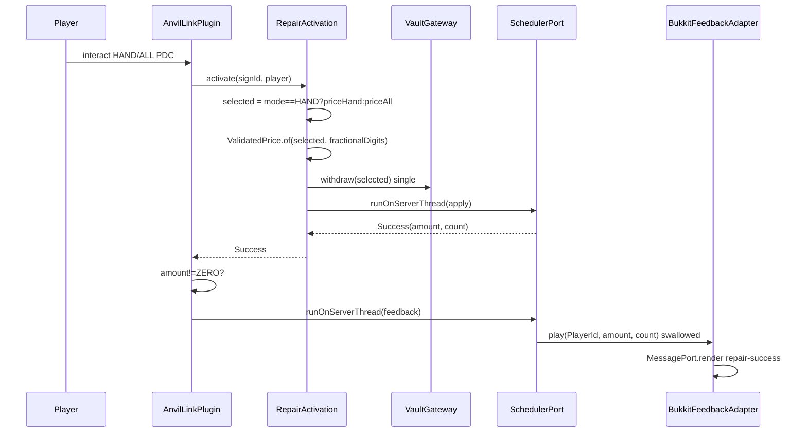

# Design: price-per-mode-and-feedback

## Technical Approach

Hexagonal extension — `domain <- adapters` preserved. Reuses `AtomicReference<ConfigSnapshot>` atomic swap and hand-rolled YAML scan (avoids SnakeYAML 1.30/2.2 skew). `RepairActivation` selects `priceHand`/`priceAll` by PDC-validated `RepairMode`, then `ValidatedPrice` precision check; single-withdrawal + compensation unchanged. New pure `FeedbackPort`; `BukkitFeedbackAdapter` runs post-commit, swallowed, on server thread.

## Architecture Decisions

| Decision | Choice | Alternatives | Rationale |
|---|---|---|---|
| Per-mode source | `ConfigSnapshot(priceHand, priceAll, feedbackEnabled, feedbackSound, feedbackParticles)` explicit; parser requires both under `price:` header, rejects bare `price: <scalar>` | `PriceCatalog(Map)` / `PricePolicy` | Two modes only — explicit fields = trivial switch, keeps snapshot simple, decouples load from `fractionalDigits` |
| Floor | `MoneyAmount.MIN_PRICE=10_000` + mirror in `ValidatedPrice`; parser also rejects | Parser-only | Defense in depth when parsing bypassed |
| Precision timing | `ValidatedPrice.of(selected, fractionalDigits)` per mode at activation | Validate both at load | `fractionalDigits` global from Vault; per-mode check satisfies spec without masking other mode |
| Success count | `TransactionResult.Success(BigDecimal amount, int repairedCount)` | Count in entrypoint | Count is transaction outcome; required for `{count}` and spec |
| Feedback isolation | `FeedbackPort.play(PlayerId, amount, count)` pure; adapter via `SchedulerPort.runOnServerThread`, swallowed | Inline in activation/plugin | Keeps `domain/**` free of `org.bukkit.*`/`net.kyori.*`; failure never compensates/retries |

## Data Flow

```
config.yml -> FileConfigurationPort.parseFile() -> validated ConfigSnapshot -> AtomicReference.swap
interact -> PDC mode -> selector (HAND?priceHand:priceAll) -> ValidatedPrice(fractionalDigits)
  -> RepairPlanner -> if empty Success(ZERO) else withdraw(selected) once
  -> runOnServerThread(applyRepair) -> Success(amount,count)
  -> if amount!=ZERO runOnServerThread(feedback.play) swallowed -> MessagePort.render(repair-success)
```

`MiniMessageMessagePort` unchanged (Adventure 4.11.0 at `anvillink.libs.kyori`); `VaultEconomyGateway` unchanged but per-mode precision validated at activation.

## Sequence Diagram



Feedback after commitment/compensation boundary; adapter exceptions never reach `RepairActivation`.

## File Changes

| File | Action | Description |
|------|--------|-------------|
| `src/main/resources/config.yml` | Modify | `price.hand`/`price.all` mandatory + `feedback:` + `messages.repair-success` |
| `src/main/java/.../domain/ports/ConfigurationPort.java` | Modify | `ConfigSnapshot(priceHand, priceAll, targetDistance, messages, activationEnabled, feedbackEnabled, sound, particles)` |
| `src/main/java/.../adapter/FileConfigurationPort.java` | Modify | Nested scan under `price:` header, reject scalar, require both, enforce >=10_000, parse `feedback:` |
| `src/main/java/.../domain/MoneyAmount.java` | Modify | `MIN_PRICE=10_000` floor |
| `src/main/java/.../domain/ValidatedPrice.java` | Modify | Mirror floor + `representableAt` |
| `src/main/java/.../domain/TransactionResult.java` | Modify | `Success(amount, repairedCount)` |
| `src/main/java/.../domain/RepairActivation.java` | Modify | Switch on `rec.get().mode()` before `ValidatedPrice.of` |
| `src/main/java/.../domain/ports/FeedbackPort.java` | Create | `play(PlayerId, BigDecimal, int)` pure |
| `src/main/java/.../adapter/BukkitFeedbackAdapter.java` | Create | Sound+particles+MessagePort, swallowed, server thread |
| `src/main/java/.../entrypoint/AnvilLinkPlugin.java` | Modify | Wire `FeedbackPort`, gate `amount!=ZERO` after apply |
| `gradle/libs.versions.toml` | Unchanged | Adventure 4.11.0 reused |

## Interfaces / Contracts

```java
// MoneyAmount — added invariant
public record MoneyAmount(BigDecimal value) {
  public static final BigDecimal MIN_PRICE = new BigDecimal("10000");
}
// ConfigurationPort
record ConfigSnapshot(BigDecimal priceHand, BigDecimal priceAll, int targetDistance,
  Map<String,String> messages, boolean activationEnabled,
  boolean feedbackEnabled, String feedbackSound, String feedbackParticles) {}
// FeedbackPort — pure, no Bukkit/Adventure
public interface FeedbackPort { void play(SignPort.PlayerId p, BigDecimal amount, int count); }
// TransactionResult
record Success(BigDecimal amount, int repairedCount) implements TransactionResult {}
```

```yaml
# config.yml — breaking schema
price:
  hand: 12000.00  # mandatory >=10000, finite, representable
  all:  25000.00
feedback:
  enabled: true
  sound: BLOCK_ANVIL_USE
  particles: CRIT
messages:
  repair-success: "<green>Repaired {count} items for {price}.</green>"
```

Bare `price: 25.00` invalid. Errors: `missing price.hand`, `missing price.all`, `price below floor`, `invalid precision`.

## Testing Strategy

| Layer | What | Approach |
|-------|------|----------|
| Unit | Floor 10_000; selector HAND/ALL; per-mode precision fail-closed; Success count | JUnit, no mocks; RED first (TDD) |
| Integration | Parser rejects scalar/missing/below-floor/bad scale; reload retains prior; feedback swallowed + server thread | JUnit + MockBukkit 4.110.0; SchedulerPort fake |
| E2E | Single withdraw per mode, empty->Success(ZERO) no charge/feedback, disabled silent, throw keeps Success | MockBukkit + Vault double |

Domain purity: `domain/**` forbids `org.bukkit.*`, `net.milkbowl.*`, `net.kyori.*`; `FeedbackPort` uses `PlayerId`/`BigDecimal`/`int` only.

Concurrency: `SchedulerPort.runOnServerThread` for `applyRepair` and `feedback.play`; sound/particles require server thread.

Failure modes: parse fail-closed -> `activationEnabled=false` at startup or `ReloadOutcome.Failure(reason, retained)` on reload (no partial apply). Per-mode precision at activation. Feedback swallowed, no deposit/restoration.

## Threat Matrix

N/A — no routing, shell, subprocess, VCS/PR automation, executable-file classification, or process-integration boundary. Hand-rolled scan over trusted `config.yml` only.

## Migration / Rollout

**MAJOR bump** (breaking config). Startup invalid -> `activationEnabled=false` + warning. Reload invalid -> atomic retain + `reload-failure`. Rollback: restore `price: 25.00`, single-field `ConfigSnapshot`, single-price parser/validator/selector, delete `FeedbackPort`/`BukkitFeedbackAdapter`; operators restore `config.yml` + `/anvillink reload`. No PDC migration.

Slices (single change): slice 1 pricing transactional (config+domain+selector+Success), slice 2 feedback presentation (port/adapter+wiring+messages).

## Open Questions

None.
